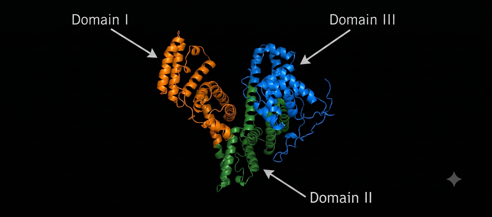
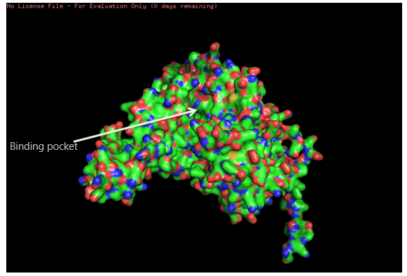

# 3D Protein Structure Prediction & Analysis of liver cancer associated Human Alpha-Fetoprotein (AFP)

## 📌 Project Overview
This independent bioinformatics project focuses on predicting and analyzing the 3D structure of human Alpha-Fetoprotein (AFP), a critical clinical biomarker structurally upregulated in Hepatocellular Carcinoma (primary liver cancer). 

* **Protein Name:** Alpha-Fetoprotein (AFP)
* **Organism:** Homo sapiens (Human)
* **UniProt Accession:** P02771

## ❓ Biological Question
The primary goal of this project is to answer: **What does the 3D structural architecture of human Alpha-Fetoprotein (AFP) look like, and where are its primary ligand-binding domains located?**

## 🛠️ Tools & Methodology
* **Data Retrieval:** UniProt KB (obtained raw FASTA sequence)
* **Structure Prediction:** ColabFold (AlphaFold2) executed via Google Colab GPU runtime environment (MMseqs2 MSA generation)
* **3D Visualization:** PyMOL (Educational Version)

## 📊 Results & Visualization

### 1. Cartoon Structural View

* **Observation:** The AlphaFold2 prediction successfully rendered AFP's asymmetric, all-alpha-helical structure, clearly showcasing the characteristic three-domain V-shape architecture.

### 2. Surface Structure & Binding Pockets

* **Observation:** Transitioning to a surface rendering revealed prominent, deep hydrophobic cavities nestled between the junctions of the three structural domains. 

## 💡 Conclusion & Interpretation
By translating the raw amino acid sequence into a 3D structural model, this project successfully identified the spatial geometry of AFP's functional architecture. The deep cavities identified in the surface view represent the primary active ligand-binding domains. In a clinical context, these pockets are responsible for encapsulating and transporting metabolic cargo (like fatty acids and steroids) inside liver cancer cells, making them potential targets for small-molecule drug design.
so this is how my readme looks like 
